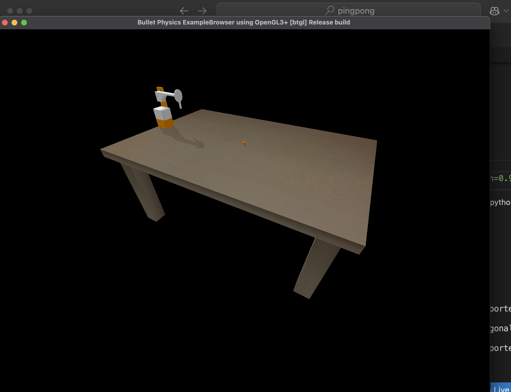
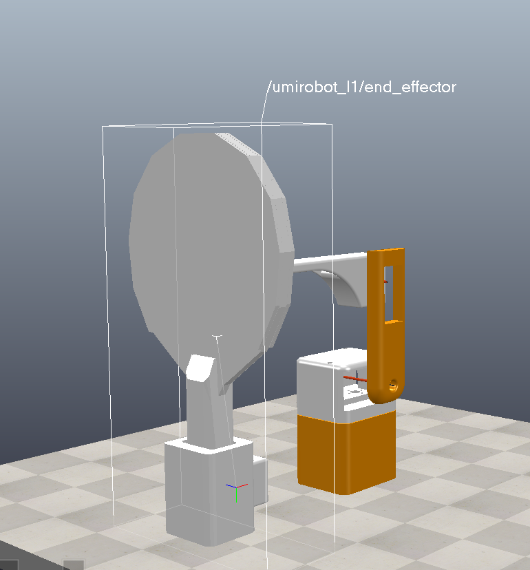

# Robot Table Tennis: Simulation, Reinforcement Learning, and ONNX Deployment

An experimental project exploring whether a tabletop robot arm could learn to return a ping pong ball. The work combines custom MuJoCo robot and table models, a Gymnasium environment, PPO policy training, ONNX export, and an early remote-inference-to-motor-control prototype.

**Status: research prototype.** I built and iterated the simulation, trained and evaluated PPO policies, exported policies to ONNX, and explored an inference service and Raspberry Pi motor client. I did not achieve reliable rallies or a complete game against a person.

## Simulation

The project includes a simulated robot, racket, ball, and table, with geometry and scene definitions under `urdf/` and `stl/`.



The robot and racket geometry were iterated alongside the environment:



[Watch the early simulation screen recording](media/pingpong-simulation.mp4)

## What I built

- **Robot and scene models:** URDF and MuJoCo XML assets for the arm, racket, ball, and table.
- **Custom Gymnasium environments:** `PingPongEnv` and an earlier bouncing environment, with observations based on robot joint state and ball, racket, and target positions.
- **PPO training experiments:** Stable-Baselines3 training, continuation, and evaluation scripts, with 60 archived ping pong runs, checkpoints, evaluation files, and TensorBoard events.
- **ONNX inference path:** four exported PPO policy variants and ONNX Runtime inference code are included in `test/cloud_deployment/`.
- **Remote inference prototype:** a FastAPI service loads an ONNX model and returns policy actions, with an optional end-effector calculation.
- **Motor-control experiment:** a Raspberry Pi GPIO client explores forwarding policy actions to servo PWM outputs. It is a prototype and does not establish a validated real-time control loop.

## Policy and deployment workflow

```text
MuJoCo simulation
       ↓
Gymnasium environment
       ↓
PPO training and evaluation
       ↓
ONNX export → ONNX Runtime inference
       ↓
FastAPI request/response prototype
       ↓
Raspberry Pi GPIO motor-control experiment
```

The ONNX and hardware stages are experiments toward deployment. Model input dimensions, action scaling, timing, servo calibration, and the full perception-to-control loop have not been validated together for reliable play.

## Repository layout

```text
.
├── urdf/                         # Robot, racket, and table models
├── stl/                          # Robot mesh assets
├── media/                        # Simulation screenshots and recording
└── test/
    ├── gymnasium_env/            # Custom environments and wrappers
    ├── logs/ppo/                 # Ping pong runs, checkpoints, and metrics
    └── cloud_deployment/         # ONNX models, FastAPI, and Pi client prototype
```

The ping pong training runs are retained as experiment evidence. The separate air hockey environment and its runs were excluded from this repository's ping pong results.

## Training and evaluation

The original training scripts and experiment settings are under `test/`. For example, `test/pong.py` trains a PPO policy in `gymnasium_env/PingPongEnv-v0`, and `test/continueTrain.py` continues from a saved checkpoint. `test/testModel.py` loads a checkpoint for interactive evaluation.

To run the experiments, install the dependencies in `test/pyproject.toml` in an environment with MuJoCo's rendering dependencies available, then install the environment package from `test/`:

```bash
cd test
python -m venv .venv
source .venv/bin/activate  # Windows: .venv\Scripts\activate
python -m pip install --upgrade pip
python -m pip install -e .
python pong.py
```

Some of the preserved scripts are exploratory and may require adapting training settings or checkpoint paths for your machine. The archived models and TensorBoard event files document prior runs; they are not a promise of successful game play.

## ONNX inference prototype

See [`test/cloud_deployment/README.md`](test/cloud_deployment/README.md) for the FastAPI and ONNX Runtime experiment. The export exploration also referenced the [SB3-to-Coral example](https://github.com/chunky/sb3_to_coral). Select an export with `ONNX_MODEL_PATH` and configure the client endpoint with `PINGPONG_INFERENCE_URL`. The Raspberry Pi client runs in dry-run mode unless `--enable-motors` is supplied.

## What I learned

Teaching a robot to play table tennis requires more than producing arm motion: the agent must predict a fast ball, time contact, learn a useful return, and translate simulated actions into calibrated hardware commands. This project produced a working experimental foundation across robot modeling, custom RL environments, PPO training, ONNX export, and deployment prototyping, while exposing the remaining gap between simulation experiments and reliable human-versus-robot play.
